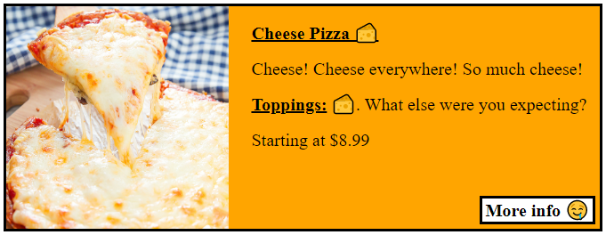

# Exercise 1 - Where's my menu?!

Let's start by creating a home page where all the available pizzas on the menu can be displayed.

Write up a quick `Homepage` component. In the `Homepage`, run a `fetch` to the correct address to grab all the pizzas on the menu.

Don't forget to display a little loading state while you wait for the `fetch` to return with the results!

> **STRETCH:** Implement Material UI's [Circular Progress](https://mui.com/material-ui/api/circular-progress/#main-content) as your loading state.

Once you receive the information, use it to generate the menu on the page. Make sure to have the following displayed:

- The pizza's name.
- The pizza's picture.
- The pizza's base price.
    - base size is small.
- The pizza's description.
- The pizza's toppings.

Lets also give it a little link that will redirect us to the `PizzaDetails` page used in the next exercise.

Each pizza card should look something like this (but less ugly):

---

Remember to look at the [API Documentation](../server/API_DOC.md) to figure out what address you need to `fetch`!

[Back to README](../README.md)