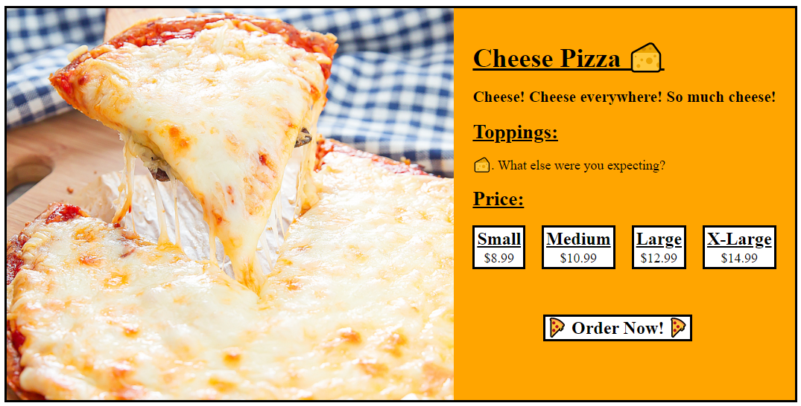

# Exercise 2 - Pick your ~~Poison~~ Pizza!

No poison here, I promise! 😇

Now that you have a main menu, let create a pizza details page! Remember that little link from [exercise-1](exercise-1.md)? Make it send the pizza's ID through the URL as a parameter to `"/pizza/:pizzaId"`. Oh and create a `PizzaDetails` component.

In here you need to:
1. Grab the `pizzaId` from the URL.
2. Use it to `fetch` the details of the pizza selected by the user.
3. Display all of the pizza's information on the whole page.
4. Add a little link that will redirect the user to the order page (used in the next exercise).

> PS: Don't forget your loading state!

It should look a little something like this (but less ugly):

---

Remember to look at the [API Documentation](../server/API_DOC.md) to figure out what address you need to `fetch`!

[Back to README](../README.md)